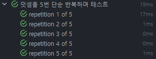
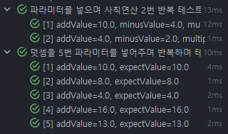

### ✅ 테스트 환경
- IntelliJ
- Java 21
- Spring Boot 3.4
- JUnit 5

### ✅ xUnit & JUnit

xUnit 이란?
- 테스트 도구에서 사용되는 테스트 프레임워크의 일종
- 다양한 프로그래밍 언어를 지원하며, 테스트 작성, 실행, 결과 분석 등을 효과적으로 수행할 수 있도록 도움
- 테스트 주도 개발(Test-Driven Development, TDD) 및 애자일 개발 방법론에서 널리 사용됨
- JUnit(Java), PHPUnit(PHP) 등 다양한 xUnit 도구 존재

xUnit 특징
- 테스트 케이스 작성
    - 테스트 케이스를 작성할 수 있는 기본적인 구조와 애너테이션을 제공
    - 개발자는 테스트 메서드를 작성하고, 애너테이션을 사용하여 테스트 구성 가능
- 테스트 실행
    - 테스트 케이스를 실행하고 테스트 결과를 수집하는 런처 또는 테스트 실행기를 제공
    - 테스트를 자동으로 실행하고, 예외 처리 및 테스트 결과 기록 가능
- 단언(Assertion)
    - 단언(assertion) 메서드를 통해 예상 결과와 실제 결과를 비교하여 테스트 결과를 확인
    - 코드의 동작이 예상대로 수행되고 있는지 검증 가능
- 테스트 결과 분석
    - 테스트 결과를 분석하고 요약하여 제공
    - 성공한 테스트, 실패한 테스트, 테스트 커버리지 등의 정보를 통해 테스트의 진행 상황과 코드의 품질 판단 가능

### ✅ AAA & GWT 패턴

AAA 패턴
1. Arrange(준비) 단계: 객체/변수 초기화나 데이터 설정 등 테스트에 필요한 초기 상태 설정하는 단계
2. Act(실행) 단계: 실제로 테스트할 메서드/함수 호출하고 특정 동작 수행하는 테스트 대상 코드 실행하는 단계
3. Assert(단언) 단계: 예상 결과 확인 및 검증하고 성공/실패 여부 판단하는 단계

GWT 패턴
1. Given: Arrange 단계에 대응
2. When: Act 단계에 대응
3. Then: Assert 단계에 대응

### ✅ JUnit 테스트 예제

#### @DisplayName

- 테스트 메서드나 테스트 클래스에 사용되며, 테스트 케이스의 이름을 지정하는 데 사용

```
@Test
@DisplayName("테스트 테스트 테스트")
void testTestTest() {
}
```

#### @DisplayNameGeneration

- 테스트 클래스에 사용되며, 테스트 메서드의 이름을 동적으로 생성하는 데 사용

```
@DisplayNameGeneration(DisplayNameGenerator.ReplaceUnderscores.class)
class JUnitPracticeTest {

    @Test
    void test_test_test() {}
}
```


#### JUnit에서 자주 사용하는 메서드
1. assertEquals()

- 두 값이 동일한지 확인

```
@Test
void assert_equals_test() {
    String expect = "Something";
    String actual = "Something";
    
    Assertions.assertEquals(expect, actual);
}
```

2. assertNotEquals()

- 두 값이 다른지 확인

```
@Test
@DisplayName("Assert Not Equals 메서드 테스트")
void assertNotEqualsTest() {
    String expect = "Something";
    String actual = "Hello";
    
    Assertions.assertNotEquals(expect, actual);
}
```

3. assertTrue()

- 조건이 참인지 확인

```
@Test
@DisplayName("Assert True 메서드 테스트")
void assertTrueTest() {
    Integer a = 10;
    Integer b = 10;
    
    Assertions.assertTrue(a.equals(b));
}
```

4. assertFalse()

- 조건이 거짓인지 확인

```
@Test
@DisplayName("Assert False 메서드 테스트")
void assertFalseTest() {
    Integer a = 10;
    Integer b = 20;

    Assertions.assertFalse(a.equals(b));
}
```

5. assertNull()

- 값이 null인지 확인

```
@Test
@DisplayName("Assert Null 메서드 테스트")
void assertNullTest() {
    String value = null;
    
    Assertions.assertNull(value);
}
```

6. assertNotNull()

- 값이 null이 아닌지 확인

```
@Test
@DisplayName("Assert Not Null 메서드 테스트")
void assertNotNullTest() {
    String value = "Hello";
    
    Assertions.assertNotNull(value);
}
```

7. assertThrows()

- 예외가 발생하는지 확인

```
@Test
@DisplayName("Assert Throws 메서드 테스트")
void assertThrowsTest() {
    Assertions.assertThrows(RuntimeException.class, () -> {
        throw new RuntimeException("임의로 발생시킨 에러");
    });
}
```

8. assertIterableEquals()

- 두 Iterable 객체가 동일한 요소를 포함하고 있고 순서도 같은지 확인

```
@Test
@DisplayName("Assert Iterable 메서드 테스트")
void assertIterableEqualsTest() {
    List<Integer> list1 = List.of(1, 2);
    List<Integer> list2 = List.of(1, 2);

    Assertions.assertIterableEquals(list1, list2);
}
```

9. assertAll()

- 여러 Assertion을 그룹화하여 모두 실행하고, 실패한 경우에도 나머지 Assertion들을 계속 실행

```
@Test
@DisplayName("Assert All 메서드 테스트")
void assertAllTest(){
String expect = "Something";
String actual = "Something";

    Assertions.assertEquals(expect, actual);

    List<Integer> list1 = List.of(1, 2);
    List<Integer> list2 = List.of(1, 2);

    Assertions.assertIterableEquals(list1, list2);

    Assertions.assertAll("Assert All", List.of(
        () -> { Assertions.assertEquals(expect, actual); },
        () -> { Assertions.assertIterableEquals(list1, list2); }
    ));
}
```

### ✅ 간단한 계산기 테스트 예제

모든 테스트 케이스에 AAA & GWT 패턴을 적용한다.

1. 계산기 생성

- 덧셈, 뺄셈, 곱셈, 나눗셈, 출력, 0으로 나눌 때 발생시킬 예외 순으로 만들어줬다.

```
// MyCalculator 클래스

public class MyCalculator {
private Double result;

    public MyCalculator() {
        this.result = 0.0;
    }
    
    public MyCalculator(Double result) {
        this.result = result;
    }
    
    public MyCalculator add(Double number) {
        this.result += number;
        return this;
    }
    
    public MyCalculator minus(Double number) {
        this.result -= number;
        return this;
    }
    
    public MyCalculator multiply(Double number) {
        this.result *= number;
        return this;
    }
    
    public MyCalculator divide(Double number) {
        if (number == 0.0) {
            throw new ZeroDivisionException();
        }
        this.result /= number;
        return this;
    }
    
    public Double getResult() {
        return this.result;
    }
    
    public static class ZeroDivisionException extends RuntimeException {
    }
}
```

 2. 계산기 기능 테스트

- 각 기능에 대한 간단한 테스트 코드.

```
@Test
@DisplayName("MyCalculator 덧셈 테스트")
void addTest() {
    // AAA 패턴

    // Arrange - 준비
    MyCalculator myCalculator = new MyCalculator();

    // Act - 행동
    myCalculator.add(10.0);

    // Assert - 단언/검증
    Assertions.assertEquals(10.0, myCalculator.getResult());
}

@Test
@DisplayName("MyCalculator 뺄셈 테스트")
void minusTest() {
    // GWT 패턴

    // Given - 준비 - Arrange
    MyCalculator myCalculator = new MyCalculator(10.0);

    // When - 행동/연산 - Act
    myCalculator.minus(5.0);

    // Then - 검증/비교/단언 - Assert
    Assertions.assertEquals(5.0, myCalculator.getResult());
}

@Test
@DisplayName("MyCalculator 곱셈 테스트")
void multiplyTest() {
    // given
    MyCalculator myCalculator = new MyCalculator(2.0);

    // when
    myCalculator.multiply(2.0);

    // then
    Assertions.assertEquals(4.0, myCalculator.getResult());
}

@Test
@DisplayName("MyCalculator 나눗셈 테스트")
void divideTest() {
    MyCalculator myCalculator = new MyCalculator(10.0);

    myCalculator.divide(2.0);

    Assertions.assertEquals(5.0, myCalculator.getResult());
}

@Test
@DisplayName("MyCalculator 사칙연산 테스트")
void complicatedCalculatorTest(){
    // given
    MyCalculator myCalculator = new MyCalculator(0.0);

    // when
    Double result = myCalculator
        .add(10.0)
        .minus(4.0)
        .multiply(2.0)
        .divide(3.0)
        .getResult();

    // then
    Assertions.assertEquals(4.0, result);
}

@Test
@DisplayName("MyCalculator 0으로 나누었을 때에는 ZeroDivisionException 을 발생시켜야 함")
void divideZeroTest(){
    // given
    MyCalculator myCalculator = new MyCalculator(10.0);

    // when & then
    Assertions.assertThrows(MyCalculator.ZeroDivisionException.class, () -> {
        myCalculator.divide(0.0);
    });
}
```

#### 3. 계산기 기능 반복 테스트

#### @RepeatedTest

- 동일한 테스트를 여러 번 반복 실행하도록 지정하는 데 사용

```
@DisplayName("덧셈을 5번 단순 반복하며 테스트")
@RepeatedTest(5)
void repeatedAddTest(){
    // Arrange - 준비
    MyCalculator myCalculator = new MyCalculator();

    // Act - 행동
    myCalculator.add(10.0);

    // Assert - 단언/검증
    Assertions.assertEquals(10.0, myCalculator.getResult());
}
```



#### @ParameterizedTest

- 매개변수화된 테스트를 정의하는 데 사용
- @ValueSource, @EnumSource, @MethodSource, @CsvSource, @CsvFileSource 등과 함께 사용
- @MethodSource << 가장 많이 사용됨

#### @MethodSource가 많이 사용되는 이유

- 높은 재사용성
  - 테스트 데이터를 별도의 메소드로 분리하여 여러 테스트 케이스에서 재사용할 수 있다.
  - 데이터 생성 로직을 한 곳에서 관리할 수 있어 유지보수가 용이하다.

- 복잡한 객체 생성 가능
  - @CsvSource나 @ValueSource와 달리, 메소드를 통해 복잡한 객체나 컬렉션을 자유롭게 생성이 가능하다.
  - 테스트에 필요한 어떤 형태의 데이터든 프로그래밍적으로 구성이 가능하다.

- 동적 데이터 생성 가능
  - 런타임에 동적으로 테스트 데이터를 생성할 수 있다.
  - 외부 리소스나 설정에 따라 테스트 데이터를 유연하게 변경할 수 있다.

- 가독성
  - 테스트 코드와 테스트 데이터가 명확히 분리되어 코드의 가독성이 향상된다.
  - 데이터 생성 메소드에 의미 있는 이름을 부여할 수 있어 테스트의 의도를 더 잘 전달할 수 있다.

#### @MethodSource 제약조건
1. 매개변수를 생성하는 정적 메서드를 작성. 이때 Stream, Iterable, Iterator 등의 형태로 리턴해야 함
2. @ParameterizedTest와 함께 사용하고 매개변수 메서드 지정

#### @ParameterizedTest + @MethodSource 예시

```
@DisplayName("덧셈을 5번 파라미터를 넣어주며 반복하며 테스트")
@ParameterizedTest
@MethodSource("parameterizedTestParameters")
void parameterizedTest(Double addValue, Double expectValue){
    // Arrange - 준비
    MyCalculator myCalculator = new MyCalculator(0.0);

    // Act - 행동
    myCalculator.add(addValue);

    // Assert - 단언/검증
    Assertions.assertEquals(expectValue, myCalculator.getResult());
}

public static Stream<Arguments> parameterizedTestParameters() {
    return Stream.of(
        Arguments.of(10.0, 10.0),
        Arguments.of(8.0, 8.0),
        Arguments.of(4.0, 4.0),
        Arguments.of(16.0, 16.0),
        Arguments.of(13.0, 13.0)
    );
}

@DisplayName("파라미터를 넣으며 사칙연산 2번 반복 테스트")
@ParameterizedTest
@MethodSource("parameterizedComplicatedCalculateTestParameters")
void parameterizedComplicatedCalculateTest(
    Double addValue,
    Double minusValue,
    Double multiplyValue,
    Double divideValue,
    Double expectValue
){
    // given
    MyCalculator myCalculator = new MyCalculator(0.0);

    // when
    Double result = myCalculator
        .add(addValue)
        .minus(minusValue)
        .multiply(multiplyValue)
        .divide(divideValue)
        .getResult();

    // then
    Assertions.assertEquals(expectValue, result);
}

public static Stream<Arguments> parameterizedComplicatedCalculateTestParameters() {
    return Stream.of(
        Arguments.of(10.0, 4.0, 2.0, 3.0, 4.0),
        Arguments.of(4.0, 2.0, 4.0, 4.0, 2.0)
    );
}
```




### ✅ Reference
- [스프링 테스트 By 쥬쥬](https://www.inflearn.com/course/%EC%A5%AC%EC%A5%AC%EC%99%80-%ED%95%98%EB%A3%A8%EB%A7%8C%EC%97%90-%EB%81%9D%EB%82%B4%EB%8A%94-%EC%8A%A4%ED%94%84%EB%A7%81%ED%85%8C%EC%8A%A4%ED%8A%B8)