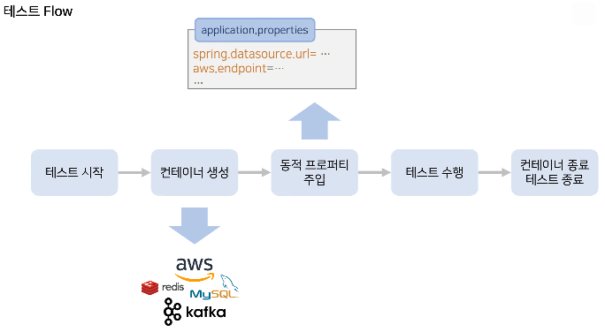

### ✅ 테스트 환경

- IntelliJ
- Java 21
- Spring Boot 3.4
- JUnit 5
- Mockito
- Docker
- Spring Data JPA
- MySQL 8.0
- Flyway

### ✅ 통합 테스트



#### 통합 테스트 과정

1. 테스트 시작 : 테스트를 시작합니다
2. 컨테이너 생성 : testcontainers가 Docker를 이용해 테스트 필요한 컨테이너들(MySQL, Redis 등..)을 생성합니다
3. 동적 프로퍼티 주입 : 생성한 컨테이너의 정보를 기반으로 스프링 프로퍼티 동적으로 주입(overwrite)합니다
4. 테스트 수행 : 생성한 컨테이너를 활용하여 테스트를 수행합니다
5. 테스트 종료: 테스트 종료와 동시에 생성했던 컨테이너들을 정리합니다

#### 통합 테스트 세팅

```
/**
 * 통합 테스트를 위한 기본 설정 클래스
 * TestContainers를 사용하여 Docker 기반의 테스트 환경을 구성
 */
@Ignore  // JUnit이 이 클래스를 직접 테스트로 실행하지 않도록 설정
@Transactional  // 각 테스트 메소드를 트랜잭션으로 감싸고 테스트 완료 후 롤백
@SpringBootTest  // Spring Boot 통합 테스트를 위한 전체 애플리케이션 컨텍스트 로드
@ContextConfiguration(initializers = IntegrationTest.IntegrationTestInitializer.class)  // 테스트 컨텍스트 초기화 설정
public class IntegrationTest {

    // TestContainers의 DockerComposeContainer를 사용하여 DB 관리
    static DockerComposeContainer rdbms;
    
    // Docker 컨테이너 초기화 및 시작
    // DB, 마이그레이션(flyway) 설정하고 실행
    static {
        // Docker Compose 설정 파일을 이용하여 컨테이너 초기화
        rdbms = new DockerComposeContainer(new File("infra/test/docker-compose.yaml"))
            // MySQL 설정
            .withExposedService(
                "local-db",
                3306,
                Wait.forLogMessage(".*ready for connections.*", 1)  // DB 준비 완료 로그 대기
                    .withStartupTimeout(Duration.ofSeconds(300))  // 최대 300초 대기
            )
            // 마이그레이션(flyway) 설정
            .withExposedService(
                "local-db-migrate",
                0,  // 포트는 임의로 할당 (사용하지 않음)
                Wait.forLogMessage("(.*Successfully applied.*)|(.*Successfully validated.*)", 1)  // 마이그레이션(flyway) 완료 로그 대기
                    .withStartupTimeout(Duration.ofSeconds(300))  // 최대 300초 대기
            );

        // Docker 컨테이너 시작
        rdbms.start();
    }

    // Spring 애플리케이션 컨텍스트 초기화를 담당하는 내부 클래스
    // 테스트용 DB 연결 정보를 설정
    static class IntegrationTestInitializer implements ApplicationContextInitializer<ConfigurableApplicationContext> {

        @Override
        public void initialize(ConfigurableApplicationContext applicationContext) {
            // 테스트 속성을 저장할 Map 생성
            Map<String, String> properties = new HashMap<>();

            // Docker 컨테이너에서 실행 중인 MySQL의 호스트와 포트 정보 가져오기
            var rdbmsHost = rdbms.getServiceHost("local-db", 3306);
            var rdbmsPort = rdbms.getServicePort("local-db", 3306);

            // DB 연결 URL 생성 및 설정
            properties.put("spring.datasource.url", "jdbc:mysql://" + rdbmsHost + ":" + rdbmsPort + "/score");
            
            // 생성된 속성을 Spring 애플리케이션 컨텍스트에 적용
            TestPropertyValues.of(properties)
                .applyTo(applicationContext);
        }
    }
}
```

#### MySQL 테스트 예시

```
class StudentScoreServiceIntegrationTest extends IntegrationTest {

	@Autowired
	private StudentScoreService studentScoreService;

	@Autowired
	private EntityManager entityManager;

	@Test
	void savePassedStudentScoreTest() {
		// given
		var studentScore = StudentScoreFixture.passed();

		// when
		studentScoreService.saveScore(
			studentScore.getExam(),
			studentScore.getStudentName(),
			studentScore.getKorScore(),
			studentScore.getEnglishScore(),
			studentScore.getMathScore()
		);

		entityManager.flush();
		entityManager.clear();

		// then
		var passedStudentResponses = studentScoreService.getPassStudentsList(studentScore.getExam());

		Assertions.assertEquals(1, passedStudentResponses.size());

		var passedStudentResponse = passedStudentResponses.get(0);

		var calculator = new MyCalculator(0.0);

		Assertions.assertEquals(studentScore.getStudentName(), passedStudentResponse.getStudentName());
		Assertions.assertEquals(
			calculator
				.add(studentScore.getKorScore().doubleValue())
				.add(studentScore.getEnglishScore().doubleValue())
				.add(studentScore.getMathScore().doubleValue())
				.divide(3.0)
				.getResult(),
			passedStudentResponse.getAvgScore()
		);
	}

	@Test
	void saveFailedStudentScoreTest() {
		// given
		var studentScore = StudentScoreFixture.failed();

		// when
		studentScoreService.saveScore(
			studentScore.getExam(),
			studentScore.getStudentName(),
			studentScore.getKorScore(),
			studentScore.getEnglishScore(),
			studentScore.getMathScore()
		);

		entityManager.flush();
		entityManager.clear();

		// then
		var failedStudentResponses = studentScoreService.getFailStudentsList(studentScore.getExam());

		Assertions.assertEquals(1, failedStudentResponses.size());

		var failedStudentResponse = failedStudentResponses.get(0);

		var calculator = new MyCalculator(0.0);

		Assertions.assertEquals(studentScore.getStudentName(), failedStudentResponse.getStudentName());
		Assertions.assertEquals(
			calculator
				.add(studentScore.getKorScore().doubleValue())
				.add(studentScore.getEnglishScore().doubleValue())
				.add(studentScore.getMathScore().doubleValue())
				.divide(3.0)
				.getResult(),
			failedStudentResponse.getAvgScore()
		);
	}
}
```

### ✅ Redis 테스트

#### Redis 세팅 추가

```
@Ignore
@Transactional
@SpringBootTest
@ContextConfiguration(initializers = IntegrationTest.IntegrationTestInitializer.class)
public class IntegrationTest {

	static DockerComposeContainer rdbms;
	static RedisContainer redis;

	static {
		rdbms = new DockerComposeContainer(new File("infra/test/docker-compose.yml"))
			.withExposedService(
				"local-db",
				3306,
				Wait.forLogMessage(".*ready for connections.*", 1)
					.withStartupTimeout(Duration.ofSeconds(300))
			)
			.withExposedService(
				"local-db-migrate",
				0,
				Wait.forLogMessage("(.*Successfully applied.*)|(.*Successfully validated.*)", 1)
					.withStartupTimeout(Duration.ofSeconds(300))
			);

		rdbms.start();

        // Redis 컨테이너 세팅 및 시작
		redis = new RedisContainer(RedisContainer.DEFAULT_IMAGE_NAME.withTag("6"));
		redis.start();
	}

	static class IntegrationTestInitializer implements ApplicationContextInitializer<ConfigurableApplicationContext> {

		@Override
		public void initialize(ConfigurableApplicationContext applicationContext) {
			Map<String, String> properties = new HashMap<>();

			var rdbmsHost = rdbms.getServiceHost("local-db", 3306);
			var rdbmsPort = rdbms.getServicePort("local-db", 3306);

			properties.put("spring.datasource.url", "jdbc:mysql://" + rdbmsHost + ":" + rdbmsPort + "/score");

            // Docker 컨테이너에서 실행 중인 Redis의 호스트와 포트 정보 가져오기
			var redisHost = redis.getHost();
			var redisPort = redis.getFirstMappedPort();

            // Redis Host, Port 추가
			properties.put("spring.datasource.redis.host", redisHost);
			properties.put("spring.datasource.redis.port", redisPort.toString());

			TestPropertyValues.of(properties)
				.applyTo(applicationContext);
		}
	}
}
```

#### Redis 테스트 예시

```
class RedisServiceTest extends IntegrationTest {

	@Autowired
	private RedisService redisService;

	@Test
	@DisplayName("Redis Get / Set 테스트")
	void redisGetSetTest() {
		// given
		String expectValue = "hello";
		String key = "hi";

		// when
		redisService.set(key, expectValue);

		// then
		String actualValue = redisService.get(key);

		Assertions.assertEquals(expectValue, actualValue);
	}
}
```

### ✅ AWS S3 테스트

#### AWS S3 세팅 추가

```
@Ignore
@Transactional
@SpringBootTest
@ContextConfiguration(initializers = IntegrationTest.IntegrationTestInitializer.class)
public class IntegrationTest {

	static DockerComposeContainer rdbms;

	static RedisContainer redis;

	static LocalStackContainer aws;

	static {
		rdbms = new DockerComposeContainer(new File("infra/test/docker-compose.yml"))
			.withExposedService(
				"local-db",
				3306,
				Wait.forLogMessage(".*ready for connections.*", 1)
					.withStartupTimeout(Duration.ofSeconds(300))
			)
			.withExposedService(
				"local-db-migrate",
				0,
				Wait.forLogMessage("(.*Successfully applied.*)|(.*Successfully validated.*)", 1)
					.withStartupTimeout(Duration.ofSeconds(300))
			);

		rdbms.start();

		redis = new RedisContainer(RedisContainer.DEFAULT_IMAGE_NAME.withTag("6"));
		redis.start();

		// LocalStack 이미지 버전 지정 (0.11.2 버전 사용)
        DockerImageName imageName = DockerImageName.parse("localstack/localstack:0.11.2");
        
        // LocalStack 컨테이너 설정
        aws = (new LocalStackContainer(imageName))
            // S3 서비스만 활성화 (필요한 경우 다른 AWS 서비스도 추가 가능)
            .withServices(LocalStackContainer.Service.S3)
            // 컨테이너 시작 대기 시간 설정 (10분)
            .withStartupTimeout(Duration.ofSeconds(600));
        
        // LocalStack 컨테이너 시작
        aws.start();
	}

	static class IntegrationTestInitializer implements ApplicationContextInitializer<ConfigurableApplicationContext> {

		@Override
		public void initialize(ConfigurableApplicationContext applicationContext) {
			Map<String, String> properties = new HashMap<>();

			var rdbmsHost = rdbms.getServiceHost("local-db", 3306);
			var rdbmsPort = rdbms.getServicePort("local-db", 3306);

			properties.put("spring.datasource.url", "jdbc:mysql://" + rdbmsHost + ":" + rdbmsPort + "/score");

			var redisHost = redis.getHost();
			var redisPort = redis.getFirstMappedPort();

			properties.put("spring.datasource.redis.host", redisHost);
			properties.put("spring.datasource.redis.port", redisPort.toString());

			 try {
                // LocalStack 컨테이너 내부에서 S3 버킷 생성 명령 실행
                aws.execInContainer(
                    "awslocal",          // LocalStack용 AWS CLI 도구
                    "s3api",             // S3 API 명령어 그룹
                    "create-bucket",      // 버킷 생성 명령
                    "--bucket",          // 버킷 이름 옵션
                    "test-bucket"        // 생성할 버킷 이름
                );

                // LocalStack의 엔드포인트를 스프링 설정에 추가
				properties.put("aws.endpoint", aws.getEndpoint().toString());
			} catch (Exception e) {
				// ignore
			}

			TestPropertyValues.of(properties)
				.applyTo(applicationContext);
		}
	}
}
```

#### AWS S3 테스트 예시

```
class S3ServiceTest extends IntegrationTest {

	@Autowired
	private S3Service s3Service;

	@Test
	void s3PutAndGetTest() throws IOException {
		// given
		var bucket = "test-bucket";
		var key = "sampleObject.xt";
		var sampleFile = new ClassPathResource("static/sample.txt").getFile();

		// when
		s3Service.putFile(bucket, key, sampleFile);

		// then
		var resultfile = s3Service.getFile(bucket, key);

		List<String> sampleFileLines = FileUtils.readLines(sampleFile);
		List<String> resultFileLines = FileUtils.readLines(resultfile);

		Assertions.assertIterableEquals(sampleFileLines, resultFileLines);
	}
}
```

### ✅ Kafka 테스트

#### Kafka 세팅 추가

```
@Ignore
@Transactional
@SpringBootTest
@ContextConfiguration(initializers = IntegrationTest.IntegrationTestInitializer.class)
public class IntegrationTest {

	static DockerComposeContainer rdbms;

	static RedisContainer redis;

	static LocalStackContainer aws;

	static KafkaContainer kafka;

	static {
		rdbms = new DockerComposeContainer(new File("infra/test/docker-compose.yml"))
			.withExposedService(
				"local-db",
				3306,
				Wait.forLogMessage(".*ready for connections.*", 1)
					.withStartupTimeout(Duration.ofSeconds(300))
			)
			.withExposedService(
				"local-db-migrate",
				0,
				Wait.forLogMessage("(.*Successfully applied.*)|(.*Successfully validated.*)", 1)
					.withStartupTimeout(Duration.ofSeconds(300))
			);

		rdbms.start();

		redis = new RedisContainer(RedisContainer.DEFAULT_IMAGE_NAME.withTag("6"));
		redis.start();

		DockerImageName imageName = DockerImageName.parse("localstack/localstack:0.11.2");
		aws = (new LocalStackContainer(imageName))
			.withServices(LocalStackContainer.Service.S3)
			.withStartupTimeout(Duration.ofSeconds(600));
		aws.start();

		// Kafka 컨테이너 초기화
        kafka = new KafkaContainer(
            // Confluent Platform Kafka 이미지 사용 (버전 7.5.0)
            DockerImageName.parse("confluentinc/cp-kafka:7.5.0"))
            // Kafka Raft(KRaft) 모드 활성화
            // KRaft는 Zookeeper 없이 Kafka를 실행할 수 있게 해주는 새로운 아키텍처
            .withKraft();
        
        // Kafka 컨테이너 시작
        kafka.start();
	}

	static class IntegrationTestInitializer implements ApplicationContextInitializer<ConfigurableApplicationContext> {

		@Override
		public void initialize(ConfigurableApplicationContext applicationContext) {
			Map<String, String> properties = new HashMap<>();

			var rdbmsHost = rdbms.getServiceHost("local-db", 3306);
			var rdbmsPort = rdbms.getServicePort("local-db", 3306);

			properties.put("spring.datasource.url", "jdbc:mysql://" + rdbmsHost + ":" + rdbmsPort + "/score");

			var redisHost = redis.getHost();
			var redisPort = redis.getFirstMappedPort();

			properties.put("spring.datasource.redis.host", redisHost);
			properties.put("spring.datasource.redis.port", redisPort.toString());

			try {
				aws.execInContainer(
					"awslocal",
					"s3api",
					"create-bucket",
					"--bucket",
					"test-bucket"
				);

				properties.put("aws.endpoint", aws.getEndpoint().toString());
			} catch (Exception e) {
				// ignore
			}

			// Kafka 브로커 주소를 스프링 설정에 추가
            // getBootstrapServers()는 Kafka 브로커의 호스트:포트 형식의 접속 정보를 반환
            properties.put("spring.kafka.bootstrap-servers", kafka.getBootstrapServers());

			TestPropertyValues.of(properties)
				.applyTo(applicationContext);
		}
	}
}
```

#### Kafka 테스트 예시

```
class KafkaConsumerApplicationTests extends IntegrationTest {

	@Autowired
	private KafkaProducerService kafkaProducerService;

	@MockitoBean
	private KafkaConsumerService kafkaConsumerService;

	@Test
	void kafkaSendAndConsumeTest() {
        // given
		String topic = "test-topic";
		String expectValue = "expect-value";

		// when
		kafkaProducerService.send(topic, expectValue);

		// then
		// Consumer가 받은 메시지를 캡처하기 위한 ArgumentCaptor 생성
		var stringCaptor = ArgumentCaptor.forClass(String.class);

		// Consumer의 process 메서드 호출 검증
		// timeout(5000): 최대 5초 동안 대기
		// times(1): 정확히 1번 호출되었는지 확인
		Mockito.verify(kafkaConsumerService, Mockito.timeout(5000).times(1))
			.process(stringCaptor.capture());

		Assertions.assertEquals(expectValue, stringCaptor.getValue());
	}
}
```

### ✅ Reference

- [스프링 테스트 By 쥬쥬](https://www.inflearn.com/course/%EC%A5%AC%EC%A5%AC%EC%99%80-%ED%95%98%EB%A3%A8%EB%A7%8C%EC%97%90-%EB%81%9D%EB%82%B4%EB%8A%94-%EC%8A%A4%ED%94%84%EB%A7%81%ED%85%8C%EC%8A%A4%ED%8A%B8)